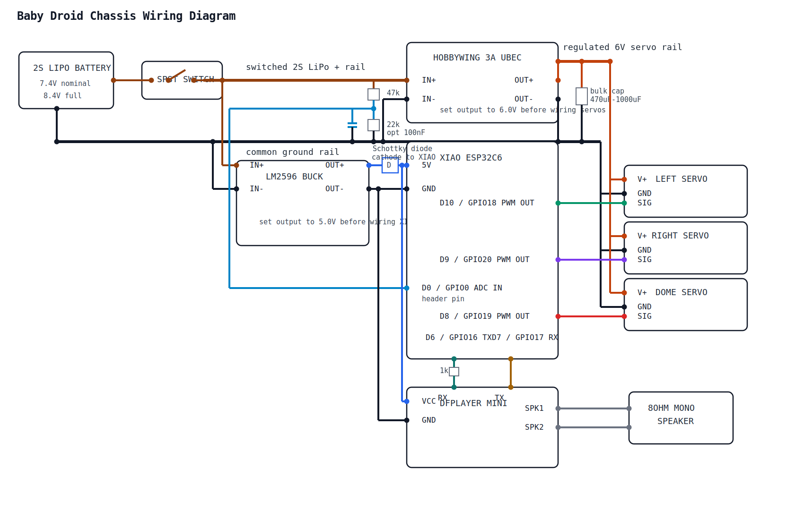

# Baby Droid Chassis

**XIAO ESP32C6-based wireless chassis controller for R2-D2 style droids** using continuous rotation servos and ESP-NOW communication protocol.

This firmware provides differential drive control for a two-wheeled droid with independent dome rotation, featuring thread-safe command processing, automatic safety timeouts, and optional MAC address filtering for secure operation.

---

## 📋 Table of Contents

- [Features](#features)
- [Hardware Requirements](#hardware-requirements)
- [Wiring Plan](#wiring-plan)
- [Software Requirements](#software-requirements)
- [Quick Start](#quick-start)
- [Detailed Setup](#detailed-setup)
- [Servo Calibration](#servo-calibration)
- [Configuration Guide](#configuration-guide)
- [Control Mapping](#control-mapping)
- [Architecture](#architecture)
- [Troubleshooting](#troubleshooting)
- [Project Structure](#project-structure)

---

## ✨ Features

- **Wireless Control**: ESP-NOW protocol for low-latency, reliable communication
- **Differential Drive**: Tank-style steering with independent wheel control
- **Independent Dome Rotation**: Control dome separately from drive motors
- **Thread-Safe Operation**: FreeRTOS mutex protection for concurrent ESP-NOW callbacks
- **Safety Features**:
  - Automatic motor stop on command timeout (500ms default)
  - Optional MAC address filtering for security
  - Graceful handling of connection loss
- **Flexible Servo Support**: Custom pulse width range (800-2200µs) for various servo types
- **Individual Servo Calibration**: Per-servo stop position tuning
- **Advanced Drive Modes**:
  - Forward/backward drive
  - In-place rotation (spin turns)
  - Curved turns while driving (25% inner wheel speed reduction)

---

## 🔧 Hardware Requirements

### Required Components

- **Microcontroller**: Seeed Studio XIAO ESP32C6
- **Servos**: 3× FEETECH `FS90R` continuous rotation servos
  - 2× Drive servos (left/right wheels)
  - 1× Dome rotation servo
- **Audio Module**: DFPlayer Mini MP3 player with microSD / TF card
- **Speaker**: 1× 8Ω mono speaker connected directly to the DFPlayer speaker outputs
- **Battery**: 1× `2S LiPo` battery pack (`7.4V` nominal, `8.4V` fully charged)
- **Servo Power Regulator**: Hobbywing `3A UBEC` (set to `6.0V` output before connecting the servos)
- **Servo Rail Stabilization**: 1× `470uF-1000uF` electrolytic capacitor across the regulated `6.0V` servo rail and ground
- **Logic Power Converter**: LM2596-based buck converter (set to `5.0V` output before connecting the MCU)
- **MCU Power Protection**: 1× Schottky diode on the external `5V` feed into the XIAO `5V` pin
- **Battery Sense Divider**: `47kΩ` from switched battery `+` to `D0 / GPIO0`, `22kΩ` from `D0 / GPIO0` to ground
- **Battery Sense Filter**: optional `100nF` ceramic capacitor from `D0 / GPIO0` to ground
- **Power Control**: Single-pole inline power switch on the main positive lead

> **Power assumption**: this wiring plan assumes a single `2S LiPo` feeding two separate branches after the switch: a regulated `6.0V` UBEC branch for the `FS90R` servos and a regulated `5.0V` LM2596 branch for the XIAO and DFPlayer. A `2S LiPo` is too high to connect directly to the servos or the XIAO.

## 🔌 Wiring Plan



### XIAO ESP32C6 Signal Wiring

| Function | XIAO Pin | ESP32-C6 GPIO | Connects To | Notes |
|----------|----------|---------------|-------------|-------|
| Battery voltage sense | D0 | GPIO0 | Resistor divider on switched battery rail | Header pin ADC input for easier hand wiring |
| Left wheel servo signal | D10 | GPIO18 | Left drive servo signal wire | Direct PWM from MCU |
| Right wheel servo signal | D9 | GPIO20 | Right drive servo signal wire | Direct PWM from MCU |
| Dome servo signal | D8 | GPIO19 | Dome rotation servo signal wire | Direct PWM from MCU |
| DFPlayer TX to MCU RX | D7 | GPIO17 | DFPlayer `TX` | Use XIAO hardware UART RX |
| MCU TX to DFPlayer RX | D6 | GPIO16 | DFPlayer `RX` through `1kΩ` series resistor | Use XIAO hardware UART TX |
| Logic power input | 5V | VBUS | LM2596 `OUT+` through a Schottky diode | Cathode faces the XIAO `5V` pin |
| Common ground | GND | GND | LM2596 `OUT-` and all servo grounds | Required for PWM reference |

Using `D0` for battery sense keeps the analog divider on a normal header pin, which is easier to solder and strain-relieve in a hand-wired build. The servos use `D10`, `D9`, and `D8`; these are also the XIAO SPI pins, so keep them dedicated to the servos unless the wiring is changed again. The servos are powered from the UBEC-regulated `6.0V` rail; only the PWM control lines come from the XIAO. The DFPlayer is wired on the XIAO ESP32C6 hardware UART using `D6` as TX and `D7` as RX.

### DFPlayer Audio Wiring

| DFPlayer Pin | Connects To | Notes |
|--------------|-------------|-------|
| `VCC` | XIAO `5V` / Schottky diode cathode node | DFPlayer shares the XIAO-side protected 5V branch |
| `GND` | Common ground rail | Must be shared with the XIAO and servos |
| `RX` | XIAO `D6` through `1kΩ` resistor | Recommended by DFRobot to reduce noise and level issues |
| `TX` | XIAO `D7` | Direct UART return path |
| `SPK1` | Speaker terminal 1 | Direct mono speaker output |
| `SPK2` | Speaker terminal 2 | Direct mono speaker output |

### Power Topology

```text
Battery + (2S LiPo) -> SPST switch -> switched battery + rail
switched battery + rail -> Hobbywing 3A UBEC IN+
switched battery + rail -> LM2596 IN+

Battery - -> common ground rail
common ground rail -> Hobbywing 3A UBEC IN-
common ground rail -> Hobbywing 3A UBEC OUT-
common ground rail -> left servo GND
common ground rail -> right servo GND
common ground rail -> dome servo GND
common ground rail -> LM2596 IN-
common ground rail -> LM2596 OUT-
common ground rail -> XIAO GND
common ground rail -> DFPlayer GND
common ground rail -> 22k resistor -> XIAO D0 / GPIO0 battery sense node
common ground rail -> optional 100nF capacitor -> XIAO D0 / GPIO0 battery sense node

Hobbywing 3A UBEC OUT+ (set to 6.0V) -> left servo V+
Hobbywing 3A UBEC OUT+ (set to 6.0V) -> right servo V+
Hobbywing 3A UBEC OUT+ (set to 6.0V) -> dome servo V+
Hobbywing 3A UBEC OUT+ (set to 6.0V) -> capacitor +
switched battery + rail -> 47k resistor -> XIAO D0 / GPIO0 battery sense node
common ground rail -> capacitor -
LM2596 OUT+ (set to 5.0V) -> Schottky diode anode
Schottky diode cathode -> XIAO 5V pin
Schottky diode cathode -> DFPlayer VCC
XIAO D0 -> battery sense divider node
XIAO D10 -> left servo signal
XIAO D9 -> right servo signal
XIAO D8 -> dome servo signal
XIAO D6 -> 1k resistor -> DFPlayer RX
DFPlayer TX -> XIAO D7
DFPlayer SPK1 -> speaker terminal 1
DFPlayer SPK2 -> speaker terminal 2
```

### Wiring Notes

- Do **not** connect the `2S LiPo` directly to the XIAO ESP32C6.
- Do **not** connect the `2S LiPo` directly to the `FS90R` servos.
- Set and verify the Hobbywing UBEC output to `6.0V` before connecting the servos.
- Place the `470uF-1000uF` capacitor physically near the UBEC output or servo power split, with correct electrolytic polarity.
- Keep the battery sense divider on the **switched** battery rail so it draws no current when the robot is powered off.
- The battery sense divider is designed around `47kΩ / 22kΩ`. If you change those values, update the firmware constants in [`include/config.h`](/Volumes/documents/github/szelenka/baby-droid-chassis/include/config.h:44).
- Set and verify the LM2596 output with a multimeter before connecting it to the XIAO `5V` pin.
- Feed the XIAO `5V` pin through a Schottky diode, with the diode cathode toward the XIAO, to match Seeed's external power guidance and reduce USB backfeed risk.
- All grounds must remain tied together or the servos will not have a stable PWM reference.
- The `FS90R` servos are documented to accept both `5V` and `3.3V` servo control signals, so direct PWM from the XIAO is expected to work.
- The DFPlayer speaker should be connected to `SPK1` and `SPK2`, not to the DAC line outputs.
- Use a FAT16/FAT32 microSD card in the DFPlayer and avoid hot-plugging it while powered.

### Battery Monitoring Behavior

The release firmware continuously samples the switched `2S LiPo` rail through the `47kΩ / 22kΩ` divider and uses the XIAO user LED (`GPIO15`) plus serial logging as the low-battery indicator.

- `LOW` battery warning: below `7.0V` filtered pack voltage
- `LOW` clears: above `7.2V`
- `CRITICAL` battery cutoff: below `6.8V`
- `CRITICAL` clears: above `7.0V`
- `LOW` indication: slow blink on the XIAO user LED
- `CRITICAL` indication: fast blink on the XIAO user LED and drive outputs forced to stop

If the onboard LED behaves inverted on your hardware revision, flip `BATTERY_STATUS_LED_ACTIVE_LOW` in [`include/config.h`](/Volumes/documents/github/szelenka/baby-droid-chassis/include/config.h:61).

---

## 💻 Software Requirements

- **PlatformIO**: Install via [platformio.org](https://platformio.org/install)
- **Companion Project**: [baby-droid-controller](https://github.com/szelenka/baby-droid-controller) (for wireless control)

### Dependencies (auto-installed by PlatformIO)

- ESP32 Arduino Framework
- ESP32Servo library (v3.0.9+)
- WiFi library
- FreeRTOS (included with ESP32 core)

---

## 🚀 Quick Start

```bash
# 1. Clone and navigate to project
cd baby-droid-chassis

# 2. Build and upload firmware (using Makefile)
make upload

# OR using PlatformIO directly
pio run -e release --target upload

# 3. Open serial monitor to get MAC address
make monitor
# OR: pio device monitor

# 4. Copy the displayed MAC address (format: {0xAA, 0xBB, ...})
#    and configure it in the controller project

# 5. Test servos and calibrate if needed (see Servo Calibration section)
```

### Build Environments

This project has two build environments:

- **`release`** (default): Normal operation with ESP-NOW control
- **`calibrate`**: Servo calibration tool

**Quick commands** (using Makefile):
```bash
make help          # Show all available commands
make release       # Build, upload, and monitor (release mode)
make calibrate     # Build, upload, and monitor (calibration mode)
```

**Or use PlatformIO directly**:
```bash
pio run -e release --target upload    # Release firmware
pio run -e calibrate --target upload  # Calibration firmware
```

---

## 📖 Detailed Setup

### Step 1: Get Chassis MAC Address

1. **Build and upload** the chassis firmware:
   ```bash
   pio run --target upload
   ```

2. **Open serial monitor**:
   ```bash
   pio device monitor
   ```

3. **Look for output** like:
   ```
   ESP32 Baby Droid Chassis Starting...
   ESP32 MAC Address: {0xAA, 0xBB, 0xCC, 0xDD, 0xEE, 0xFF}
   Use this MAC address in the controller's TARGET_MAC_ADDRESS
   Chassis ready!
   ```

4. **Copy the MAC address** (the part in curly braces).

### Step 2: Configure the Controller

1. Navigate to the **baby-droid-controller** project
2. Edit `include/config.h`
3. Set `TARGET_MAC_ADDRESS` to the chassis MAC:
   ```cpp
   #define TARGET_MAC_ADDRESS {0xAA, 0xBB, 0xCC, 0xDD, 0xEE, 0xFF}
   ```
4. Rebuild and upload the controller firmware

### Step 3: (Optional) Enable MAC Filtering

For added security, restrict which controller can send commands:

1. Get the **controller's MAC address** (shown in its serial output)
2. Edit `include/config.h` in the **chassis** project
3. Set or uncomment:
   ```cpp
   #define ALLOWED_CONTROLLER_MAC {0x0C, 0x8B, 0x95, 0x94, 0xF1, 0x00}
   ```
4. To **disable filtering**, comment out the line:
   ```cpp
   // #define ALLOWED_CONTROLLER_MAC {0x0C, 0x8B, 0x95, 0x94, 0xF1, 0x00}
   ```

### Step 4: Test Communication

Power on both devices. You should see:
- Controller: "ESP-NOW initialized successfully"
- Chassis: "Received button mask: ..." when buttons are pressed

Press controller buttons and verify servo movement.

---

## 🎯 Servo Calibration

Continuous rotation servos require calibration to find their **exact stop position** (typically near 1500µs, but varies per servo).

### Signs You Need Calibration

- Servos spin slowly when they should be stopped
- Droid drifts when no commands are sent
- Uneven wheel speeds during straight driving

### Calibration Process

1. **Edit calibration settings** in `src/calibrate_servo.cpp`:
   ```cpp
   #define TEST_PIN D10            // Change to D10, D9, or D8
   #define APPROX_STOP_US 1400     // Approximate stop point from config.h
   ```

2. **Run calibration mode**:
   ```bash
   make calibrate
   # OR: pio run -e calibrate --target upload && pio device monitor
   ```

3. **Watch the servo** as it sweeps through pulse widths:
   - The tool tests from `APPROX_STOP_US - 100µs` to `APPROX_STOP_US + 100µs`
   - Steps through in 10µs increments
   - Each value holds for 3 seconds
   - Note which microsecond value **completely stops** the servo

4. **Update stop positions** in `include/config.h`:
   ```cpp
   #define SERVO_LEFT_STOP_US   1455  // Use your calibrated value
   #define SERVO_RIGHT_STOP_US  1455  // Use your calibrated value
   #define SERVO_DOME_STOP_US   1465  // Use your calibrated value
   ```

5. **Switch back to release mode**:
   ```bash
   make release
   # OR: pio run -e release --target upload
   ```

### Fine-Tuning Tips

- Adjust in **5µs increments** for precision
- Test under load (with wheels on ground)
- Left/right servos may need different values due to mechanical differences

---

## ⚙️ Configuration Guide

All settings are in `include/config.h`:

### Servo Pins

```cpp
#define SERVO_LEFT_PIN      D10  // Left wheel on D10 / GPIO18
#define SERVO_RIGHT_PIN     D9   // Right wheel on D9 / GPIO20
#define SERVO_DOME_PIN      D8   // Dome rotation on D8 / GPIO19
```

### Servo Pulse Width Range

```cpp
#define SERVO_MIN_US        800   // Minimum pulse (full reverse)
#define SERVO_MAX_US        2200  // Maximum pulse (full forward)
```
> Standard servos use 1000-2000µs. Adjust if your servos differ.

### Speed Configuration (Microsecond Offsets)

```cpp
#define DRIVE_SPEED_US      400   // Forward/backward speed
#define TURN_SPEED_US       350   // In-place turn speed
#define DOME_SPEED_US       150   // Dome rotation speed
```

**How it works**: These values are **added/subtracted** from the stop position.
- Example: `SERVO_LEFT_STOP_US (1455) + DRIVE_SPEED_US (400) = 1855µs` (forward)
- Example: `SERVO_LEFT_STOP_US (1455) - DRIVE_SPEED_US (400) = 1055µs` (backward)

**Tuning tips**:
- Start with lower values (200-300) and increase gradually
- Higher values = faster movement but less control
- Keep within `SERVO_MIN_US` to `SERVO_MAX_US` range

### Safety & Communication

```cpp
#define COMMAND_TIMEOUT     500   // Stop motors after 500ms of no commands
#define WIFI_CHANNEL        1     // Must match controller's channel
```

---

## 🎮 Control Mapping

| Button | Function | Behavior |
|--------|----------|----------|
| **Button 1** | Dome Left | Rotates dome counter-clockwise |
| **Button 2** | Dome Right | Rotates dome clockwise |
| **Button 3** | Turn Right | Spin in place (or curve right while driving) |
| **Button 4** | Turn Left | Spin in place (or curve left while driving) |
| **Button 5** | Play Sound | *(Not implemented)* |
| **Button 6** | Drive Backward | Both wheels reverse |
| **Button 7** | Drive Forward | Both wheels forward |
| **Button 8** | Auxiliary | *(Not implemented)* |

### Differential Drive Behavior

| Input Combination | Result |
|-------------------|--------|
| **Forward only** | Both wheels full speed forward |
| **Backward only** | Both wheels full speed reverse |
| **Turn left only** | Left wheel reverse, right wheel forward (spin in place) |
| **Turn right only** | Left wheel forward, right wheel reverse (spin in place) |
| **Forward + Turn left** | Right wheel full speed, left wheel 25% speed (curved turn) |
| **Forward + Turn right** | Left wheel full speed, right wheel 25% speed (curved turn) |
| **Backward + Turn** | Same logic as forward, but in reverse |

> **Note**: Dome rotation is **independent** and can be controlled simultaneously with drive.

---

## 🏗️ Architecture

### Thread Safety

The firmware uses **FreeRTOS mutexes** to protect shared variables:

- **ESP-NOW callback** (`onDataReceived`) runs in WiFi task context
- **Main loop** (`updateMotors`) runs in Arduino task context
- **Mutex** (`dataMutex`) ensures atomic updates to:
  - `currentButtonMask` (button state)
  - `lastCommandTime` (timeout tracking)

This prevents race conditions on dual-core ESP32 (WiFi on Core 0, Arduino on Core 1).

### Communication Flow

```
Controller → ESP-NOW → Chassis Callback → Mutex Lock → Update Globals → Mutex Unlock
                                                              ↓
Main Loop → Mutex Lock → Read Globals → Mutex Unlock → Calculate Speeds → Update Servos
```

### Safety Features

1. **Command Timeout**: Motors stop if no command received for 500ms
2. **MAC Filtering**: Optional whitelist for authorized controllers
3. **Pulse Width Constraints**: Servo commands clamped to safe range
4. **Graceful Degradation**: Skips update cycle if mutex unavailable

---

## 🐛 Troubleshooting

### Servos Spin When They Should Stop

**Cause**: Stop position not calibrated correctly.

**Solution**: Follow [Servo Calibration](#servo-calibration) process.

---

### No Communication Between Controller and Chassis

**Symptoms**: No "Received button mask" messages in serial monitor.

**Checks**:
1. **MAC address** correctly set in controller's `TARGET_MAC_ADDRESS`
2. **WiFi channel** matches between controller and chassis
3. **MAC filtering** disabled or controller MAC whitelisted
4. Both devices powered on and within range (~20m line-of-sight)

---

### Droid Turns Instead of Going Straight

**Cause**: Wheel servos have different stop positions or speeds.

**Solution**:
1. Calibrate each wheel servo individually
2. Adjust `SERVO_LEFT_STOP_US` and `SERVO_RIGHT_STOP_US` independently
3. Test on level surface with wheels on ground

---

### Erratic Servo Behavior / Jittering

**Possible causes**:
- **Insufficient power supply**: Servos draw high current, ensure adequate amperage
- **Loose connections**: Check servo signal wires
- **Electrical noise**: Add capacitors near servo power lines
- **Update rate too high**: Increase `delay()` in `loop()` (currently 50ms)

---

### Compilation Errors

**Missing libraries**:
```bash
pio lib install
```

**Platform issues**:
```bash
pio platform update espressif32
```

---

## 📁 Project Structure

```
baby-droid-chassis/
├── include/
│   └── config.h              # All configuration constants
├── src/
│   ├── main.cpp              # Main firmware (ESP-NOW, servo control)
│   └── calibrate_servo.cpp   # Calibration tool
├── platformio.ini            # PlatformIO build configuration (with environments)
├── Makefile                  # Convenience commands for building
├── LICENSE                   # CC BY-NC-SA 4.0 license
├── README.md                 # This file
└── .gitignore
```

### Key Files

- **`src/main.cpp`**: Core firmware with ESP-NOW callbacks, differential drive logic, and thread-safe variable handling
- **`include/config.h`**: All tunable parameters (pins, speeds, calibration values)
- **`platformio.ini`**: Build settings, board definition, library dependencies

---

## 📝 License

This project is licensed under the **Creative Commons Attribution-NonCommercial-ShareAlike 4.0 International License (CC BY-NC-SA 4.0)**.

**TL;DR**: Free for personal/educational use, no commercial use without permission.

See the [LICENSE](LICENSE) file for full details, including third-party library licenses.

## 🤝 Contributing

*(Add contribution guidelines if open source)*

## 📧 Contact

*(Add contact info or links)*
